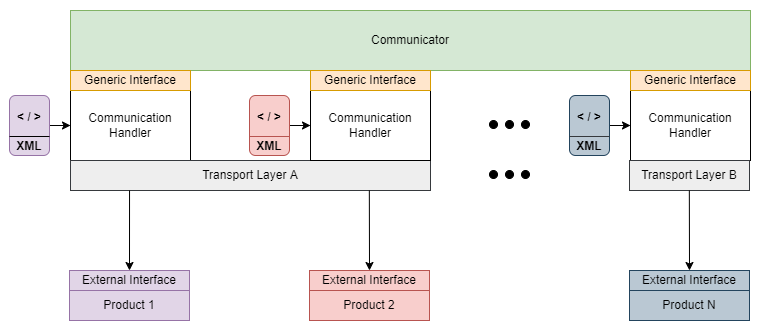

# SGr-JavaSamples

## Index
[Summary](#summary) 
[Installation](#installation) 
[Architecture](#architecture) 
[Code description](#code-description-for-the-samplecommunicator) 

## Summary
SGr-JavaSamples provides sample projects that demonstrate the use of the SGr Communication Handler Library. The goal is to set up a test environment that allows to connect SGr components and different 'products' (heat pump, charging station, inverter, battery, electricity meter etc.) through the SGr communication interface. 

## Installation

### Requirements / Prerequisites
- Java JDK version >= Java 11

### Clone
- Create a new folder for the project (eg. 'SGrJavaSamples').
- Clone the following project to a new folder: https://github.com/SmartgridReady/SGrJavaSamples.git

Rem: The folder [your-local-project-folder]/SampleCommunicator/src/main/resources contains the device description XML-files used by the SGrJavaSamples.

### Build
- Open the [your-local-project-folder]/SampleCommunicator with your IDE.
- Run the Gradle 'build' target in your IDE 
- You can also run Gradle from the command line. Change to the directory [your-local-project-folder]/SampleCommunicator and run: `gradlew clean build`

## Architecture

### Component: Communicator

<table valign="top">
    <tr>
        <td><b>Implementor:</b></td>
        <td>
Communicator Provider (3rd Party)
</td>
    </tr>
    <tr>
        <td><b>Description:</b></td>
        <td>
The 'Communicator' communicates with one or more 'Products' through the SGr 'Generic Interface'.
</td>
    </tr>
    <tr>
        <td valign="top"><b>Responsibilities:</b></td>
        <td><ul>
            <li>For each product, the communicator instantiates a Communication Handler to which a description of the product interface in XML is given.</li>
            <li>The Communicator loads a device driver for the communication interface of the product (e.g. Modbus RTU/TCP, REST...).</li>
            <li>The communicator reads or sets (analyses and/or controls) the data points.</li>
        </ul></td>
    </tr>        
    <tr>
        <td><b>SGrProject:</b></td>
        <td>
<a href="https://github.com/SmartgridReady/SGrJavaSamples/tree/master/SampleCommunicator">SGrJavaSamples/SampleCommunicator</a>
</td>
    </tr>
</table>

### Component: Generic Interface

<table valign="top">
    <tr>
        <td><b>Implementor:</b></td>
        <td>
SGr Core Team
</td>
    </tr>
    <tr>
        <td><b>Description:</b></td>
        <td>
SGr-defined 'Product'-independent interface.
</td>
    </tr>
    <tr>
        <td valign="top"><b>Responsibilities:</b></td>
        <td>
The Generic Interface is used by the Communicator to communicate with the products in the SGr network.​
</td>
    </tr>        
    <tr>
        <td><b>SGrProject:</b></td>
        <td>
<a href="https://github.com/SmartgridReady/SGrSpecifications/tree/master/SchemaDatabase/SGr/Generic">SmartgridReady/SGrSpecifications/SchemaDatabase/SGr/Generic</a>
</td>
    </tr>
</table>  

### Component: Communication Handler

<table valign="top">
    <tr>
        <td><b>Implementor:</b></td>
        <td>
SGr Core Team
</td>
    </tr>
    <tr>
        <td><b>Description:</b></td>
        <td>
This is the core component of the SGr software and it is responsible for the processing and implementation of the SGr 'Generic Interface' on the 'External Interface' of the 'Product'. 
            Instantiated by the 'Communicator' and used to communicate with the connected 'Product'.
</td>
    </tr>
    <tr>
        <td valign="top"><b>Responsibilities:</b></td>
        <td>
​Responsibilities are:

            <ul>
                <li>Reading the XML device profiles</li>
                <li>Processing commands of the Generic Interface</li>
                <li>Execute the commands on the External Interface of the product (device-specific interface)</li>
                <li>Sending the commands to the Product through the transport service specified by the Product.</li>
            </ul></td>
    </tr>
    <tr>
        <td><b>Library:</b></td>
        <td>
sgr-commhandler
</td>
    </tr>
    <tr>
        <td><b>SGrProject:</b></td>
        <td>
<a href="https://github.com/SmartgridReady/SGrJava/tree/master/CommHandler">SmartgridReady/SGrJava/CommHandler</a>
</td>
    </tr>
</table> 

### Component: XML (XML-Profile)

<table valign="top">
    <tr>
        <td><b>Implementor:</b></td>
        <td>
Provider of the 'Product'
</td>
    </tr>
    <tr>
        <td><b>Description:</b></td>
        <td>​
The XML file describes the ''function profiles', data points and attributes that can be addressed over the SGr interface. The XML file also provides general information about the 'Product'.
</td>
    </tr>
    <tr>
        <td valign="top"><b>Responsibilities:</b></td>
        <td><ul>
                <li>Providing general data on the Product.</li>
                <li>Provide the data necessary for mapping the SGr Generic Interface with the External Interface.</li>
        </ul></td>
    </tr>        
    <tr>
        <td><b>SGrProject:</b></td>
        <td>
<a href="https://github.com/SmartgridReady/SGrSpecifications/tree/master/XMLInstances/ExtInterfaces">SmartgridReady/SGrSpecifications/XMLInstances/ExtInterfaces</a>
</td>
    </tr>
</table> 

### Component: Transport Layer (Transport Service)

<table valign="top">
    <tr>
        <td><b>Implementor:</b></td>
        <td><ul>
            <li>SGr Core Team</li>
            <li>3rd Party Provider</li>
        </ul></td>
    </tr>
    <tr>
        <td><b>Description:</b></td>
        <td>
The 'TransportService' is the link to the physical communication interface of the 'Product'. The SGr Core Team provides the EasyModbus Library for Modbus.
</td>
    </tr>
    <tr>
        <td valign="top"><b>Responsibilities:</b></td>
        <td>
​The SGr Transport Service supports the following communication technologies to provide the following transport services:

            <ul>
                <li>Modbus​, REST/JSON​, Sunspec​</li>
                <li>Support is planned for:​ OCPP 2.0​, IEC-61968-9​, IEC-608070-5-104</li>
            </ul>
        </td>
    </tr> 
    <tr>
        <td><b>Library:</b></td>
        <td>

            easymodbus 
            sgr-driver-apachehttp 
            sgr-driver-hivemq

        </td>
    </tr>
    <tr>
        <td><b>SGrProject:</b></td>    
        <td>
für Modbus: <a href="https://github.com/SmartgridReady/SGrJavaDrivers/tree/master/EasyModbus">SmartgridReady/SGrJavaDrivers/EasyModbus</a>

            
für REST: <a href="https://github.com/SmartGridready/SGrJavaDrivers/tree/master/ApacheHttp">SmartgridReady/SGrJavaDrivers/ApacheHttp</a>

            
für MQTT: <a href="https://github.com/SmartGridready/SGrJavaDrivers/tree/master/HiveMq">SmartgridReady/SGrJavaDrivers/HiveMq</a>

        </td>
    </tr>
</table> 

### Component: External Interface (EI)

<table valign="top">
    <tr>
        <td><b>Implementor:</b></td>
        <td>
Manufacturer of the 'Product'
</td>
    </tr>
    <tr>
        <td><b>Description:</b></td>
        <td>
The 'External Interface' is the interface provided by the 'Product'.
</td>
    </tr>
    <tr>
        <td valign="top"><b>Responsibilities:</b></td>
        <td>
Provides the External Interface of the product. This is described in the Product XML Profile.
</td>
    </tr>
</table> 

### Component: Product

<table valign="top">
    <tr>
        <td><b>Implementor:</b></td>
        <td>
Manufacturer of the 'Product'
</td>
    </tr>
    <tr>
        <td><b>Description:</b></td>
        <td>
The Product is a device that provides properties, data points and control options.
               E.g. heat pump, charging station, inverter, battery, electricity meter.
</td>
    </tr>
    <tr>
        <td valign="top"><b>Responsibilities:</b></td>
        <td>
Product hardware.
</td>
    </tr>
</table>

## Description of the Code Samples

The code samples demonstrate how to use the commhandler library with a communicator application.
These samples use mocked devices and run without any real device: 

- BasicSampleCommunicator, demonstrates all common features
- EnumAndBitmapSampleCommunicator, demonstrates read and write of enums and bitmap registers
- AsynchronousSampleCommunicatorTest, demonstrates how to read multiple devices in parallel
- MqttSampleCommunicator, demonstrates subscribe/unsubscribe
- RestSampleCommunicator, demonstrates read/write on a REST device

This sample runs only with a real WAGO SmartMeter device:

- WagoSmartMeterCommunicator

### BasicSampleCommunicator

This sample code demonstrates all the comm features provided by a generic device.

The complete sample code can be found on [github](SampleCommunicator/src/main/java/com/smartgridready/communicator/example/BasicSampleCommunicator.java)

### EnumAndBitmapSampleCommunicator

Sample code on how to read and write enums and bitmap registers using the commhandler library.

You find the sample code on [github](SampleCommunicator/src/main/java/com/smartgridready/communicator/example/EnumAndBitmapSampleCommunicator.java)

### AsynchronousSampleCommunicator

Sample code on how to read multiple devices in parallel using the async features of the commhandler library.
This sample a JUnit5 test. Use the Junit test runner to run the sample code.

You find the sample code on [github](SampleCommunicator/src/main/java/com/smartgridready/communicator/example/AsynchronousSampleCommunicatorTest.java)

### MqttSampleCommunicator

Sample code that demonstrates subscribe/unsubscribe, which is only available with MQTT devices.

You find the sample code on [github](SampleCommunicator/src/main/java/com/smartgridready/communicator/example/MqttSampleCommunicator.java)

### RestSampleCommunicator

Sample code that demonstrates read/write on a REST device

You find the sample code on [github](SampleCommunicator/src/main/java/com/smartgridready/communicator/example/RestSampleCommunicator.java)

### WagoSmartMeterCommunicator

If you are happy owner of a WAGO Smart-Meter you can read the read values from the real device with this sample communicator application.

You find the sample code on [github](SampleCommunicator/src/main/java/com/smartgridready/communicator/example/WagoSmartMeterCommunicator.java)

## Further information / contact information

Webssite: [https://smartgridready.ch/](https://smartgridready.ch/)

E-Mail: info@smartgridready.ch
