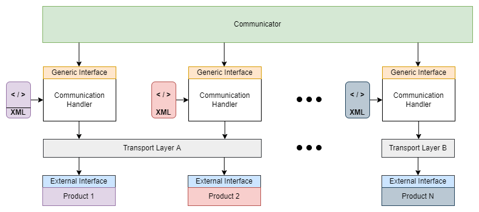

<style>
    table, th, td {
        border: 1px solid black;        
    }
    table {
        width: 100%;
        border-collapse: collapse;
    }   
    td {
        padding: 8px;
    }
</style>

# SGr-JavaSamples

SGr-JavaSamples stellt Beispielprojekte zur Verfügung, welche die Anwendung der SGr Communication Handler Library demonstrieren. Ziel ist es eine Testumgebung aufzusetzen, die es ermöglicht, SGr-Komponenten und unterschiedliche 'Products' (Wärmepumpe​, Ladestation​, Wechselrichter​, Batterie​, Stromzähler​ etc.) via SGr-Kommunikationsschnittelle zu verbinden. 



## Komponenten

### Komponente: Communicator
<table valign="top">
    <tr><td><b>Implementer:</b></td><td>Communicator Provider (3rd Party)</td></tr>
    <tr><td><b>Beschreibung:</b></td><td>Der 'Communicator' kommuniziert mit ein oder mehreren 'Products' über das SGr 'Generic Interface'. 
    <tr><td valign="top"><b>Verantwortlich:</b></td><td>
                <p>Der Communicator instanziiert für jedes Product einen Communication Handler dem eine Beschreibung der Produkteschnittstelle in XML übergeben wird.</p>
                <p>Der Communicator lädt einen Device-Treiber für die Kommunikationsschnittstelle zum Product (z.B. Modbus RTU/TCP, REST...).</p>
                <p>Der Communicator liest die Datenpunkte aus oder setzt sie (analysiert und/oder steuert)​.</p>
                <p></p> </td></tr>        
    <tr><td><b>SGrProjekt:</b></td>
    <td><a href="https://github.com/SmartgridReady/SGrJavaSamples/tree/master/SampleCommunicator">SGrJavaSamples/SampleCommunicator<a></td>
    </r>
</table>

<br><br>

### Komponente: Generic Interface
<table valign="top">
    <tr><td><b>Implementer:</b></td><td>SGr Core Team</td></tr>
    <tr><td><b>Beschreibung:</b></td><td>Von SGr vorgegebene 'Product'-unabhängige Schnittstelle. 
    <tr><td valign="top"><b>Verantwortlich:</b></td><td>
                <p>Das Generic Interface wird vom Communicator benutzt, um mit den Product's im SGr Verbund zu kommunizieren.​</p>
                <p></p> </td></tr>        
    <tr><td><b>SGrProjekt:</b></td>
    <td><a href="https://github.com/SmartgridReady/SGrSpecifications/tree/master/SchemaDatabase/SGr/Generic">SmartgridReady/SGrSpecifications/SchemaDatabase/SGr/Generic<a></td>
    </r>
</table>  

<br><br>

### Komponente: Communication Handler
<table valign="top">
    <tr><td><b>Implementer:</b></td><td>SGr Core Team</td></tr>
    <tr><td><b>Beschreibung:</b></td><td>Ist die Kernkomponente der SGr Software und damit verantwortlich für die Verarbeitung und Umsetzung des SGr 'Generic Interface' auf das 'External Interface' des 'Product'.<br>
    Wird vom 'Communicator' instanziiert und zur Kommunikation mit den angeschlossenen 'Product' benutzt.
    <tr><td valign="top"><b>Verantwortlich:</b></td><td>
                <p>​Verantwortlichkeiten sind:<br>
- Lesen der XML-Device-Profile <br>
- Verarbeiten von Kommandos der generischen Schnittstelle <br>
- Umsetzen der Kommandos auf das External Interface des Product (gerätespezifische Schnittstelle)<br>
- Senden der Kommandos an das Product über den durch das Product vorgegebenen Transportservice
</p>
                <p></p> </td></tr>
    <tr><td><b>Library:</b></td><td>commhandler4modbus.jar</td></tr>                                                                                          
    <tr><td><b>SGrProjekt:</b></td>
    <td><a href="https://github.com/SmartgridReady/SGrJava/tree/master/InterfaceFactory/CommHandler4Modbus">SmartgridReady/SGrJava/InterfaceFactory/CommHandler4Modbus<a></td>
    </r>
</table> 

<br><br>

### Komponente: XML (XML-Profile)
<table valign="top">
    <tr><td><b>Implementer:</b></td><td>Anbieter des 'Product'</td></tr>
    <tr><td><b>Beschreibung:</b></td><td>​Das XML File beschreibt die 'Funktionsprofile', Datenpunkte und Attribute, welche über die SGr-Schnittstelle angesprochen werden können​. Weiter stellt das File allgemeine Informationen zum 'Product' zur Verfügung.
    <tr><td valign="top"><b>Verantwortlich:</b></td><td>
                <p>​Bereitstellen von allgemeinen Daten zum Product.</p>
                <p>Bereitstellen der zum mapping des SGr Generic Interface auf das External Interface notwendigen Daten.</p> </td></tr>        
    <tr><td><b>SGrProjekt:</b></td>
    <td><a href="https://github.com/SmartgridReady/SGrSpecifications/tree/master/XMLInstances/ExtInterfaces">SmartgridReady/SGrSpecifications/XMLInstances/ExtInterfaces<a></td>
    </r>
</table> 

<br><br>

### Komponente: Transport Layer (Transport Service)
<table valign="top">
    <tr><td><b>Implementer:</b></td><td>- SGr Core Team<br>- 3rd Party Provider</td></tr>
    <tr><td><b>Beschreibung:</b></td><td>Der 'TransportService' bildet das Bindeglied zur physischen Kommunaktionsschnittstelle zum 'Product'. Das SGr Core Team stellt für Modbus die EasyModbus Library zur Verfügung.
    <tr><td valign="top"><b>Verantwortlich:</b></td><td>
                <p>​Der SGr Transport Service unterstützt folgende Kommunikations-Technologien, um darauf aufbauend folgende Transport Servies anzubieten:<br>
                - Modbus​, REST/JSON​, Sunspec​<br>
                - Unterstützung geplant:​ OCPP 2.0​, IEC-61968-9​, IEC-608070-5-104</p>
                <p></p> </td></tr> 
    <tr><td><b>Library:</b></td>
    <td>easymodbus.jar</td>                            
    <tr><td><b>SGrProjekt:</b></td>    
    <td>für Modbus:<br><a href="https://github.com/SmartgridReady/SGrJavaDrivers/tree/master/EasyModbus">SmartgridReady/SGrJavaDrivers/EasyModbus<a></td>
    </r>
</table> 

<br><br>

### Komponente: External Interface (EI)
<table valign="top">
    <tr><td><b>Implementer:</b></td><td>Hersteller des 'Product'</td></tr>
    <tr><td><b>Beschreibung:</b></td><td>Das 'External Interface' ist die vom 'Product' bereitgestellte Schnittstelle. 
    <tr><td valign="top"><b>Verantwortlich:</b></td><td>
                <p>Stellt das External Interface des Product zur Verfügung. Diese wird im XML-Profile zum Product beschrieben.</p></td></tr>                
</table> 

<br><br>

### Komponente: Product
<table valign="top">
    <tr><td><b>Implementer:</b></td><td>Hersteller des 'Product'</td></tr>
    <tr><td><b>Beschreibung:</b></td><td>Das Product ist ein Device, das Eigenschaften, Datenpunkte und Ansteuerungsmöglichkeiten zur Verfügung​ stellt.
Z.B. Wärmepumpe​, Ladestation​, Wechselrichter​, Batterie​, Stromzähler​ 
    <tr><td valign="top"><b>Verantwortlich:</b></td><td>
                <p>...
</p></td></tr>
</table>

<br><br>

## Anwendung der SGrJavaSamples


### Anforderungen / Prerequisits
- Gradle Version >= 7.3.3. Anm.: Wenn keine IDE mit Gradle-Integration verwendet wird, muss Gradle erst lokal installiert werden: https://gradle.org/install/
- Java JDK Version >= Java 1.8

### Clone
- Klone dieses Repo auf dein lokales Device: https://github.com/SmartgridReady/SGrJavaSamples.git

### Build
- Run gradle 'build' target in your IDE or use the command line:<br>
```bash>gradle clean build```

<br><br>

### Code-Beschreibung zum SampleCommunicator

Step 1:
Use the DeviceBeschreibungLoader class to Load the device Beschreibung from an XML file.
<br><br>
```DeviceBeschreibungLoader<SGrModbusDeviceBeschreibungType> loader = newDeviceBeschreibungLoader<>();```<br>
```SGrModbusDeviceBeschreibungType sgcpMeter = loader.load( XML_BASE_DIR,"betaModbusABBMeterV0.1.2.xml");```
<br><br>

Step2:
Load the suitable device driver to communicate with the device. The example below uses mocked driver for modbus RTU.
Change the driver to the real driver, suitable for your device. For example:
<br><br>
```GenDriverAPI4Modbus mbTCP = new GenDriverAPI4ModbusTCP();```<br>
```GenDriverAPI4Modbus mbRTU = new GenDriverAPI4ModbusRTU();```<br>
```GenDriverAPI4Modbus mbRTUMock = new GenDriverAPI4ModbusRTUMock();```
<br><br>

Step 2a (Modbus RTU only):
Initialise the serial COM port used by the modbus transport service.
```mbRTUMock.initTrspService("COM9");```
<br><br>

Step 3:
Instantiate a modbus device. Provide the device Beschreibung and the device driver instance to be used for the device.<br><br>
```SGrModbusDevice abbMeterNo1 = new SGrModbusDevice(sgcpMeter, mbRTUMock );```<br> ```try {```
<br><br>

Step 4 (Modbus RTU only): Set the unit identifier of the device to read out. <br>
```mbRTUMock.setUnitIdentifier((byte) 11);```
<br><br>

Step 5: Read the values from the device. 
- "ActiveEnerBalanceAC" is the name of the functional profile.
- "ActiveImportAC", "ActiveExportAC" and "ActiveNetAC" are the names of the Datapoints that report the values corresponding to their names.

<i>Hint: You can only read values for functional profiles and datapoints that exist in the device Beschreibung XML.</i><br>
```String acImport = abbMeterNo1.getVal("ActiveEnerBalanceAC", "ActiveImportAC");```<br>
```String acExport = abbMeterNo1.getVal("ActiveEnerBalanceAC", "ActiveExportAC");```<br>
```String acNet = abbMeterNo1.getVal("ActiveEnerBalanceAC", "ActiveNetAC");```
<br><br>

Der komplette Beispielcode ist auf GitHub:<br>
https://github.com/SmartgridReady/SGrJavaSamples/blob/documentation/SampleCommunicator/src/main/java/ch/smartgridready/communicator/example/SampleCommunicator.java
<br><br>

## Weiterführende Informationen / Kontakt

Glossar: *ToDo Link*

Webseite: https://smartgridready.ch/ <br>
E-Mail: info@smartgridready.ch